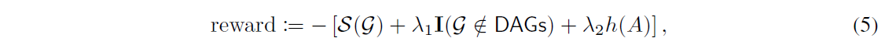

# CAUSAL DISCOVERY WITH REINFORCEMENT LEARNING (ICLR 2020)

> Shengyu Zhu, Ignavier Ng, Zhitang Chen
> Huawei Noah’s Ark Lab, University of Toronto
> {zhushengyu,chenzhitang2}@huawei.com, ignavierng@cs.toronto.edu

## ABSTRACT

发现一组变量之间的因果结构是许多经验科学中的一个基本问题。

* 传统的基于分数的因果发现方法

> 根据预定义的评分函数，依赖于不同的局部启发式搜索有向无环图（DAG）。虽然这些方法，例如贪婪等价搜索，可能有无限样本和某些模型假设的有吸引力的结果，由于有限的数据和可能的违反，它们在实践中不太令人满意假设。

* 受到神经组合优化的最新进展的启发，我们建议使用强化学习（RL）来搜索 DAG 最好的得分。

> 编码器-解码器模型将可观察数据作为输入并生成用于计算奖励的图邻接矩阵。奖励结合了预定义的评分函数和两个惩罚项来强制执行非周期性。与典型的 RL 应用程序相比，后者的目标是学习一个策略，我们使用 RL 作为搜索策略，我们的最终输出将是图，在训练期间生成的所有图中，获得最佳奖励。
我们在合成数据集和真实数据集上进行实验，并表明所提出的方法不仅具有改进的搜索能力，而且允许灵活的分数非循环约束下的函数。

## 1. INTRODUCTION

发现和理解自然现象背后的因果机制对于许多科学学科是重要的。一种有效的方法是进行受控的随机实验，然而，在例如社会科学和生物信息学等领域，这是昂贵的甚至不可能的。

* 推断来自被动可观察数据因果关系的因果发现方法很有吸引力，并且是一项重要的研究过去几十年的主题。

> 此类因果发现方法的一大类是基于分数的，它分配一个分数 S(G)，通常用观察到的数据对每个有向图 G 计算，然后搜索所有的空间获得最佳评分的有向无环图 (DAG)：

$$\min_\mathcal{G}{\mathcal{S}(\mathcal{G})},{\rm\ subject\ to\ }\mathcal{G}\in{\sf DAGs}.{\qquad\qquad}(1)$$

* 虽然已经有明确定义的评分函数:

> 例如贝叶斯信息准则 (BIC) 或最小描述长度 (MDL) 分数和贝叶斯高斯等效 (BGe) 分数，但是由于其组合性质DAG 数量超指数增加的非循环性约束图节点，问题 (1) 的求解通常是 NP-hard。

* 为了解决这个问题，大多数现有的方法依赖于局部启发式来强制执行非周期性。

> 例如，贪婪等价搜索 (GES) 一次强制执行一个边缘的非循环性，添加边时显式检查非循环性约束。众所周知，GES 可以找到全球在合适的假设下具有无限样本的最小化器，但这在有限样本制度中并不能保证。有混合方法，例如，max-min 爬山法，它使用基于约束的方法来减少在 ICLR 2020 上作为会议论文发表应用基于分数的方法之前的搜索空间。然而，这种方法通常缺乏选择特定问题的评分函数和搜索策略组合的原则方法。

* 最近，zheng 等人 对非循环性进行了平滑表征。

> 基于线性模型，问题 (1) 被公式化为一个连续优化问题 通过选择适当的损失函数（例如最小二乘损失）来构建图邻接矩阵。随后的 Yu 等人和 Lachapelle 等人也采用了证据下限和负对数似然分别作为损失函数，并使用神经网络 (NN) 建立因果关系模型。请注意，为了应用连续优化方法必须谨慎选择这些方法中的损失函数。不幸的是，许多有效的评分函数，例如，Huang 等人提出的广义评分函数和 Peters 等人提出的基于独立评分函数，要么不能以封闭形式表示，要么是非常复杂的等效损失函数，因此不能很容易地与这种方法结合。

* 根据预定义的评分函数，我们建议使用强化学习（RL）来搜索具有最佳分数的 DAG ，如【图1】所示。

> 灵感在于，具有随机策略的RL智能体（agent）可以根据所学策略的不确定性信息，自动决定在哪里进行搜索，而这些信息可以通过奖励信号流及时更新。为了将RL应用于因果发现，我们使用编码器-解码器NN模型，从观察到的数据中生成有向图，然后用来计算由预定义的分数函数以及两个惩罚项组成的奖励，迫使实现无环性。我们采用政策梯度和随机优化方法来训练NN的权重，我们的输出是在训练过程中产生的所有图形中获得最佳奖励的图形。在合成数据集和真实数据集上的实验表明，我们的方法大大提高了搜索能力，且不会牺牲选择分数的任何灵活性。特别是，在线性非高斯非循环模型（LiNGAM）和线性高斯数据集上，所提出的带有BIC分数的方法优于带有相同分数的GES，并且在因果关系为非线性时也优于最近的基于梯度的方法。

[^_^]:
    

<div align=center></div>

## 2. RELATED WORK

* 基于约束的因果发现方法首先使用条件独立性测试来发现因果关系骨架，然后确定边缘的方向直到马尔可夫等价类，它通常包含结构多样的 DAG，并且可能仍然有许多未定向的边缘。

> 例子包括 Sun 等人，张等人使用基于内核的条件独立性标准和著名的 PC 算法。此类方法涉及多个检验问题，其中检验通常是独立进行的。检验结果可能有冲突，处理起来并不容易，虽然有一些作品，例如，Hyttinen等试图解决这个问题。这些方法也不稳健，因为在构建图骨架可能会导致推断的马尔可夫等价类出现大错误。

* 另一类因果发现方法基于正确定义的功能因果模型。

> 与基于约束的方法不同，这些方法假设忠实并仅识别马尔可夫等价类，这些方法能够区分同一等价类中的不同 DAG，由于对数据分布和/或功能类的额外假设。例子包括LiNGAM，非线性加性噪声模型，以及后非线性因果模型。

* 除了Yu等人；Lachapelle等人，最近其他基于NN的因果发现方法：

> 包括Goudet等人提出了因果生成NN，以因果图初始骨架的先验知识进行功能性因果建模；Kalainathan等人以对抗性方式学习因果生成模型，但不保证非循环性。

* 最近在 sequence-to-sequence learning 方面的进展促使人们在各个领域使用 NNs 进行优化。

> 一个特殊的例子是在指针网络(pointer networks)中重新讨论旅行商问题。作者提出了一个带有非参数 softmaxes 的循环神经网络，并以监督的方式进行训练，以预测访问城市的顺序。进一步提议使用RL范式来解决组合问题，因为其奖励机制相对简单。研究表明，即使在之前的监督方法中将最优解作为标记数据，RL agent 也能有更好的效果。此外，与一般的序列到序列的建模不同，基于RL的方法考虑了（无向）图上的组合优化问题，并通过利用图的结构取得了很好的性能。

* 近年来还有许多其他成功的 RL 应用：

> 例如 AlphaGo，目标是学习给定任务的策略。作为一个例外，Zoph 和 Le 应用了强化学习到神经架构搜索。虽然我们使用类似的想法，因为 RL 范式可以自然地包括搜索任务，我们的工作在 actor 和 reward 设计上有所不同：我们的 actor 是一个编码器-解码器生成图邻接矩阵的模型（参见第 4 节），并且奖励奖励是为因果发现量身定做的，它包含了一个分数函数和非周期性约束条件（参见第5.1节）。

## 3 MODEL DEFINITION

我们假设以下模型用于数据生成过程，如 Hoyer 等人; Peters 等人。每个变量 $x_i$ 都与具有 $d$-节点的 ${\rm DAG}\ \mathcal{G}$ 中的节点 $i$ 相关联，并且 $x_i$ 的观测值是由它在图中的 parents 构成的函数加上一个独立的加性噪声$n_i$，即，
$$x_i:=f_i({\bf x}_{{\rm pa}(i)})+n_i,\ i=1,2,...,d,$$
> 其中 ${\bf x}_{{\rm pa}(i)}$ 表示变量 $x_j$的集合，以便在图中存在一条从 $x_j$ 到 $x_i$ 的边，并且假设噪声 $n_i$ 是共同独立的。我们还假设因果关系的最小化，在这种情况下，可以简化为每个函数 $f_i$ 在其任何参数中都不是常数。如果不对函数 and/or 噪声的形式做进一步的假设，在通常的马尔科夫和忠实假设下，上述模型只能被识别到马尔科夫等价类；在我们的实验中，我们将考虑从完全可识别的模型中生成的合成数据集，这样评估估计图和真正的DAG就有实际意义。如果所有函数 $f_i$ 都是线性的并且噪声 $n_i$ 是高斯分布的，则上述模型产生了Bollen所研究的那类标准线性高斯模型。当函数是线性的，但噪声是非高斯的，可以得到Shimizu等人描述的 LiNGAM, 并且在有利条件下可以唯一识别真正的 DAG。

在本文中，我们认为所有变量 $x_i$ 都是标量；扩展到更复杂的情况是，只要有一个适当定义的分数函数，就可以直接扩展到更复杂的情况。观察到的数据 $\bf X$，包括多个向量 $x:=[x_1,x_2,...,x_d]^T\in {\Bbb R}^d$，然后使用固定函数$f_i$和固定分布$n_i$，根据上述模型在一个未知的 ${\rm DAG}$ 上独立采样。因果发现的目的是使用观察到的数据 $\bf X$，它给出了 $\bf x$ 经验版本的联合分布，来推断出底层的因果 ${\rm DAG}\ \mathcal{G}$。

## 4 NEURAL NETWORK ARCHITECTURE FOR GRAPH GENERATION

给定一个数据集 ${\bf X}=\{{\bf x}^k\}_{k=1}^m$，其中 ${\bf x}^k$ 表示第 $k$ 个观察到的样本，我们想推断最能描述数据生成过程的因果图。

* 我们使用神经网络来推断来自观察数据的因果图；

> 具体来说，我们的目标是设计一个基于 NN 的图生成器，它的输入是观察到的数据，输出是一个图邻接矩阵。一个天真的选择是使用前馈神经网络输出 $d^2$ 个标量，然后将它们重塑为 ${\Bbb R}^{d×d}$ 中的邻接矩阵。然而，这种神经网络结构未能产生有希望的结果，可能是因为前馈 NNs 不能提供变量之间足够的相互作用来捕捉因果关系。

* 受到神经组合优化的最新进展的启发，尤其是指针网络，

> 我们从 ${\bf X}$ 抽取了 $n$ 个随机样本（有替换）$\{x^l\}_{l=1}^n$，并将它们重塑为 ${\bf s}:= \{\widetilde {\bf x}_i\}_{i=1}^d$，其中 $\widetilde {\bf x}_i \in {\Bbb R}^n$ 是连接 $\{{\bf x}^l\}_{l=1}^n$ 中所有第 $i$ 个条目的向量。类似于旅行商问题，这代表一个位于 $n$ 维空间中的 d 个城市的序列。我们关心的是生成二元邻接矩阵 $A \in \{0, 1\}^{d×d}$ 使得对应的图是无环的并且达到最好的分数。在这项工作中，我们考虑使用图的生成的编码器-解码器模型。

#### 编码器

> 我们在Vaswani提出的Transformer结构中使用基于注意力的编码器。我们相信，自注意力方案与结构性 ${\rm DAG}$ 约束一起，能够找到变量之间的因果关系。考虑到未来的工作，其他基于注意力的模型，例如图注意力网络也可能会使用。用 $enc_i, i=1,2,...,d,$ 表示编码器的输出，维度为$d_e$。

#### 解码器

> 我们的解码器通过在两个编码器的输出 $enc_i$ 和 $enc_j$ 之间建立关系，以 an element-wise manner 的方式生成图的邻接矩阵。我们考虑单层解码器
$$g_{ij}(W_1, W_2, u)=u^T {\rm tanh}(W_1enc_i+W_2enc_j),$$  其中 $W_1, W_2 \in {\Bbb R}^{d_h×d_e}, u \in {\Bbb R}^{d_h×1}$ 是可训练参数，$d_h$ 是与解码器相关的隐藏维度。为了生成一个二元邻接矩阵$A$，我们将每个条目 $g_{ij}$ 传入一个 logistic sigmoid function $\sigma(\cdot)$，然后根据伯努利分布进行抽样，概率为 (gij)，表示从 $x_i$ 到 $x_j$ 存在一条边的概率。为了避免自循环，我们只需屏蔽邻接矩阵中的第 $(i, i)$ 个条目。

其他解码器选择包括神经张量网络模型和双线性建立编码器输出之间成对关系的模型。另一种选择是 Transformer 解码器，它可以以行方式生成邻接矩阵。根据经验，我们发现单层解码器性能最好，可能是因为它包含的参数较少，并且是更容易训练以找到更好的 ${\rm DAGs}$，而基于自注意力的编码器已经提供了足够的变量之间的相互作用以发现因果关系。附录A提供了有关这些解码器及其使用线性高斯数据模型的经验结果。

## 5 REINFORCEMENT LEARNING FOR SEARCH

在本节中，我们使用 RL 作为我们的搜索策略来找到得分最高的 DAG，如【图1】。正如人们所看到的，所提出的方法比传统的基于分数的方法具有更好的搜索能力，并且在非周期性约束下允许灵活的分数函数。

### 5.1 SCORE FUNCTION, ACYCLICITY, AND REWARD

#### 评分函数

在这项工作中，我们只考虑现有的评分函数来构建奖励这将由RL智能体最大化。通常基于分数的方法假设参数模型因果关系（例如，线性高斯方程或多项式分布），它引入了一组参数 θ。在所有可以直接包含在这里的评分函数中，我们重点关注BIC 分数不仅是一致的，而且是局部一致的可分解性。

* 给定有向图 $\mathcal{G}$ 的 BIC 分数是

<div align=center></div>

>其中 $\hat{\theta}$ 是最大似然估计量，$d_\theta$ 表示参数 $θ$ 的维数。我们在整篇论文中假设 iid 高斯加性噪声。如果我们将线性模型应用于每个因果关系，让 $\hat{x}_i^k$ 是 $x_k^i$ 相应的估计值，即第 $k$ 个观察样本中的第 $i$ 个条目。

* 那么我们的 BIC 分数是（直到某个加性常数）

<div align=center></div>

>其中 ${\rm RSS}_i = \sum_{k=1}^D(x_i^k − \hat{x}_i^k )^2$ 表示第 $i$ 个变量的残差平方和。公式（2）中的第一项相当于 GraN-DAG 使用的对数似然目标，第二项是对图 $\mathcal{G}$ 中的边数的惩罚。噪声方差是相等的（尽管它们可能是不同的），我们有

<div align=center></div>

我们注意到 $\sum_i{\rm RSS}_i$ 是 NOTEARS 中使用的最小二乘损失。除了假设线性模型，也可以使用其他回归方法来估计 $x_i^k$ 。在第6节中，我们将使用二次回归和高斯过程回归（GPR）来建立基于观察数据的因果关系模型。

#### 非循环性

剩下的一个问题是无环性约束。除了GES在每次添加边缘时明确检查无环性外，我们在评分函数中添加了关于无环性的惩罚项，以隐含的方式强制执行无环性，并允许生成的图在每次迭代时改变一个以上的边缘。在这项工作中，我们使用了Zheng等人（2018）的一个最新结果：具有二元邻接矩阵 $A$ 的有向图 $\mathcal{G}$ 是无环的，当且仅当

<div align=center></div>

>其中 $e^A$ 是 $A$ 的矩阵指数。我们发现，h(A)是非负的，对于循环图来说可能很小，而且在所有非DAG上的最小值不容易找到。如果只有h(A)，我们将需要一个非常大的惩罚权重来保证非周期性。因此，我们增加了另一个惩罚项，即指标函数，以诱导精确的DAGs。我们注意到，其他函数（例如:图中所有循环路径的总长度），这些函数计算了从有向图到DAG的一些 "距离"，而且不必是平滑的，也可以用来构建我们方法中的非周期性惩罚。

#### 奖励

我们的奖励包含得分函数和非循环性约束：

<div align=center></div>

>其中 ${\rm I}(·)$ 表示指标函数，$λ_1,λ_2 ≥ 0$ 是两个惩罚参数。不难看出，$λ_1$ 和 $λ_2$ 越大，生成的高回报图就越可能是无环的。然后，我们的目标是使所有可能的有向图的奖励最大化，或者说，我们有

<div align=center></div>

一个有趣的问题是，这个新的表述是否等价于带有硬无环约束的原始问题。幸运的是，下面的命题保证了问题（1）和（6）在适当选择 $λ_1$ 和 $λ_2$ 的情况下是等价的。这可以通过表明一个问题的最小化器也是另一个问题的解来验证。为了完整起见，附录B中提供了证明。

#### 命题 1

设 $h_{min}>0$ 为 $h(A)$ 在所有有向环形图上的最小值，即 $h_{min} = min_{\mathcal {G} \not\in {\sf DAGs}}h(A)$。让 ${\mathcal S}^*$ 表示某个 DAG 在问题（1）中取得的最佳分数。假设 ${\mathcal S}_L \in {\Bbb R}$ 是所有可能的有向图上的得分函数的下限，即， ${\mathcal S}_L \leq {\rm min}_{\mathcal G}{\mathcal {S(G)}}$ ，而 ${\mathcal S}_U \in {\Bbb R}$ 是 ${\mathcal S}^* \leq {\mathcal S}_U$ 的最优得分的上限。那么问题 (1) 和（6）是等价的，如果

<div align=center></div>

>在实际使用中，我们需要找到各自的数量，以便选择适当的惩罚参数。上限 ${\mathcal S}_U$ 可以通过绘制一些随机的DAG或使用其他方法（如NOTEARS）的结果轻松找到。下限 ${\mathcal S}_L$ 取决于特定的分数函数。对于BIC得分，我们可以将每个变量 $x_i$ 与所有其他变量进行拟合，并且只使用 ${\rm {RSS}}_i$ 项，而忽略对边数量的加性惩罚。对于Peters等人提出的基于独立性的评分函数，我们可以简单地设置 ${\mathcal S}_L=0$ 。如前所述提到，最小项 $h_{min}$ ，可能不容易找到。幸运的是，在 $λ_1 = {\mathcal S}_U − {\mathcal S}_L$ 的情况下，命题1保证了对于任何 $λ_2$ ，问题（1）和（6）的等价性。然而，简单地设置 $λ_2=0$ 只能在非常小的图中获得良好的性能（见附录C的讨论）。我们将为 $λ_2$ 挑选一个相对较小的值，这有助于生成更接近于DAG的有向图。

从经验上看，我们发现如果初始的惩罚权重设置得过大，得分函数对奖励的影响就会很小。对奖励的影响很小，这就限制了RL agent 的探索，通常会导致DAG的高分。与拉格朗日方法类似，我们可以从小的惩罚权重开始，然后逐渐增加，以便满足命题1的条件。同时，我们注意到，不同的分数函数可能有不同的范围，而无环性惩罚项与分数函数的特定范围无关。因此，我们也通过使用 ${\mathcal S}_0({\mathcal S} - {\mathcal S}_L) / ({\mathcal S}_U - {\mathcal S}_L)$ 将预定义的分数调整到一定的范围内，对于一些 ${\mathcal S}_0 > 0$ ，最佳分数将位于 $[0: {\mathcal S}_0]$ 。我们的算法总结为 Algorithm 1，其中 $\Delta_1$ 和 $\Delta_2$ 分别是与 $λ_1$ 和 $λ_2$ 相关的更新参数， $t_0$ 表示更新频率。权重 $λ_2$ 的更新方式与 NOTEARS 使用的拉格朗日乘数的更新规则类似，我们将 $\Lambda_2$ 设定为 $λ_2$ 的上限，如前所述。在我们所有使用 BIC 作为评分函数的实验中， ${\mathcal S}_L$ 是从一个完整的有向图中得到的， ${\mathcal S}_U$ 是从一个空图中得到的。由于空图的 ${\mathcal S}_U$ 对于大图来说可能非常高，我们也通过跟踪训练期间生成的 DAG 所取得的最低分来更新它。这项工作中的其他参数选择是 ${\mathcal S}_0=5$，$t_0=1000$，$λ_1=0$，$\Delta_1=1$，$λ_2=10^{-[d/3]}$，$\Delta_2=10$ 和 $\Lambda_2=0.01$。我们评论说，这些参数的选择可以针对具体的应用进一步调整，推断出的因果图将是在不同参数选择的RL方法的所有最终输出中（参见第5.3节），一个无环，并取得最好的分数的图。

<div align=center></div>

### 5.2 ACTOR-CRITIC ALGORITHM

我们相信，RL范式中的开发和探索方案提供了一种适当的方式来指导搜索。让 $π(·|{\rm s})$ 和 $ψ$ 分别表示图生成的策略和NN参数。我们的训练目标是预期奖励，定义为

<div align=center></div>

>在训练过程中，输入 $\rm s$ 是通过从观察到的数据集 $\bf X$ 中随机抽取样本构建的，如第4节所述。

我们借助于策略梯度方法和随机方法来优化参数 $ψ$ 。梯度 $∇_ψ J(ψ | {\rm s})$ 可以通过著名的REINFORCE算法得到。我们抽取B个样本 ${\rm s}_1, {\rm s}_2,..., {\rm s}_B$ 作为一个批次(batch)来估计梯度，然后通过随机优化方法（如Adam）来训练NNs。使用参数基线来估计奖励也有助于训练。对于目前的工作，我们的 critic 是一个简单的带有ReLU单元的2层前馈NN，其输入是编码器的输出 $\{enc_i\}_{i=1}^d$。critic 是在 Adam 上使用预测和真实 reward 之间的平均平方误差(MSE)来训练的。熵正则化项也被加入以鼓励 RL agent 的探索。虽然策略梯度方法只能保证在适当条件下的局部收敛，但我们注意到，在我们的实验中，actor-critic 算法推断出的图都是DAGs。

训练一个RL代理通常需要多次迭代。在目前的工作中，我们发现，计算生成图的奖励比训练 NNs 要费时得多。因此，我们记录了对应于不同图结构的计算奖励。此外，BIC得分可以根据单一因果关系进行分解，我们也记录了相应的 ${\rm RSS}_i$，以避免重复计算。

### 5.3 FINAL OUTPUT

由于我们关注的是找到一个具有最佳分数的 DAG，而不是一个策略，所以我们记录所有在训练过程中产生的图，并输出具有最佳奖励的图。在实践中，该图可能包含虚假的边，需要进一步处理。

为此，我们可以根据回归性能或得分函数，以一种贪婪的方式修剪（prune）估计的边。对于一个推断的因果关系，我们删除一个父系变量并计算所得图形的性能，所有其他因果关系不变。如果性能不下降或在预定的容忍度范围内下降，我们就接受修剪，并以修剪后的图继续这一过程。对于线性模型，剪枝可以简单地通过对估计系数进行阈值处理来完成。

与上述修剪过程相关的是，在得分函数中增加对图中边的数量的惩罚权重。然而，这个权重并不容易选择，因为大的权重可能会造成边的丢失。在这项工作中，我们坚持使用 BIC 分数中的惩罚权重 $log_m$，然后对推断出的图进行修剪，以减少错误发现。

## 6 EXPERIMENTAL RESULTS

我们报告了在合成和真实数据集上的实证结果，将我们的方法与传统的和最近的基于梯度的方法进行比较，包括GES（含BIC得分），PC算法（采用Fisher-z检验，P值为0.01），ICA-LiNGAM，因果加性模型（CAM），NOTEARS，DAG-GNN 和 GraNDAG 等等。所有这些算法都有可用的实现方法，我们在附录D中对这些算法和它们的实现作了简要说明。除非另有说明，这些实现都使用默认超参数。对于剪枝，我们对 ICA-LiNGAM、NOTEARS 和 DAG-GNN 采用相同的阈值处理方法。由于 CAM 和 GraN-DAG 的作者提议在广义加性模型的基础上对协变量进行显著性检验，如果报告的P值低于或等于0.001，则声明显著性。我们坚持对 CAM 和 GraN-DAG 采用相同的剪枝方法。

提议的基于RL的方法是基于现有的 Tensorflow 实现的神经组合优化器（更多细节见附录D）。解码器按照第4节所述进行修改，RL算法相关的超参数保持不变。我们选择 $B=64$ 作为每次迭代的批量 (batch size) 大小，$d_h=16$ 作为单层解码器的隐藏维度。我们的方法与高斯性假设下的 BIC 分数相结合。公式（2）和（3），分别表示为 RL-BIC 和 RL-BIC2。

我们使用三个指标来评估估计的图。虚假发现率（FDR）、真实阳性率（TPR）和 结构性汉明距离（SHD）。SHD 是将估计的图转换成真正的DAG所需的最小的增加、删除和反转的 edges 数量。SHD考虑了假阳性和假阴性，较低的SHD表明对因果图的估计较好。由于 GES 和 PC 可能会输出无定向的边，我们遵循Zheng等人对 GES 和 PC 是有利的建议，只要真实图有一条有向边代替无向边，就将无向边视为真正的阳性。

### 6.1 LINEAR MODEL WITH GAUSSIAN AND NON-GAUSSIAN NOISE

给定变量数 $d$，我们生成一个 $d×d$ 的上三角矩阵作为图的二进制邻接矩阵，其中上层条目是从 ${\rm Bern}(0.5)$ 中独立抽取的。我们分配给 我们从 ${\rm Unif}([-2, -0.5] ∪[0.5, 2])$ 中独立分配边缘权重，得到权重矩阵 $W∈{\Bbb R}^{d×d}$ , 然后从高斯和非高斯噪声模型中取样 ${\bf x} = W^T{\bf x} + {\bf n} ∈ {\Bbb R}^d$。非高斯噪声与 ICA-LiNGAM 使用的噪声相同，它从高斯分布中生成样本，并通过一个幂非线性使其成为非高斯的。我们在两个模型中都选择单位噪声方差，并生成 $m=5,000$ 个样本作为我们的数据集。然后进行变量的随机置换。这个数据生成程序与 NOTEARS 和 DAG-GNN 使用的程序类似，而且这两种情况下的真实因果图都是可以识别的。

我们首先考虑具有 $d = 12$ 个节点的图。我们使用 $n = 64$ 来构建输入样本，并将最大迭代次数设置为 $20,000$ 次。我们使用一个阈值 $0.3$，与 NOTEARS 和 DAG-GNN 的数据模型一样，对估计的边进行修剪。【图2】 显示了所提方法 RL-BIC2 在线性高斯数据集上的学习过程。在这个例子中，RL-BIC2 在训练过程中生成了$683,784$ 个不同的图，远远低于 DAG 的总数（约 $5.22×10^{26}$）。修剪后的 DAG 与基础因果图完全相同。

<div align=center></div>

<div align=center></div>

我们在【表1】中报告了 LiNGAM 和线性高斯数据模型的实证结果。PC 和 GES 都表现不佳，可能是因为我们的数据生成程序考虑了相对密集的图形。CAM 的表现也不好，因为它假设了非线性的因果关系。ICA-LiNGAM 对 LiNGAM 数据恢复了所有真正的因果图，但在线性高斯数据上的表现很差。这并不奇怪，因为 ICA-LiNGAM 对非高斯噪声有效，而对线性高斯数据集不提供保证。NOTEARS 和 DAG-GNN 都有良好的因果发现结果，而 GraN-DAG 的表现要差很多。我们认为，这是因为 GraN-DAG 使用 2层前馈NNs 来建立因果关系模型，这可能无法在这个实验中无法学习到良好的线性关系。将前馈NNs修改为线性函数，可减少到 NOTEARS，以负对数似然为损失函数，在这些数据集上产生类似的性能（详细结果见附录E.1）。至于我们提出的方法，我们观察到 RL-BIC2 在本实验的两个数据模型上都能恢复所有的真实因果图，而 RL-BIC 的性能较差。人们可能会想，这种观察是否是由于我们的数据模型中使用了相同的噪声方差；我们进行了额外的实验，其中噪声方差是随机抽样的，RL-BIC2 仍然以很大的优势胜过 RL-BIC（也见附录E.1）。尽管如此，在相同的BIC分数下，RL-BIC 在两个数据集上的表现都比 GES 好得多，说明 RL 方法带来了极大的搜索能力。

最后，我们在具有 $d=30$ 个节点的更大的图上测试了所提出的方法，其中上层条目是从 ${\rm Bern}(0.2)$ 中独立采样的。这种边缘概率的选择与大图在实践中通常具有低边缘度的事实相对应。为了在我们的方法中纳入这种先验信息，我们给每个 $g_{ij}$ 添加一个初始化为 $-10$ 的共同偏置项（详见附录E.1）。考虑到搜索空间的大大增加，我们也选择了更多的观察样本数量。$n=128$，以构建图生成器的输入，并将训练迭代次数增加到 $40,000$ 次。在 LiNGAM 数据集上，RL-BIC2 的 FDR、TPR 和 SHD 分别为 $0.14±0.15, 0.94±0.07$ 和 $19.8±23.0$，与 NOTEARS 的 $0.13±0.09, 0.94±0.04, 17.2±13.12$ 相当。

### 6.2 NONLINEAR MODEL WITH QUADRATIC FUNCTIONS

我们现在考虑具有二次函数的非线性因果关系。我们以类似于第一个实验的方式生成一个上三角矩阵。对于在第 $i$ 个节点上有父母 ${\bf x}_{pa(i)}=[x_{i_1}, x_{i_2}, ...]^T$ 的因果关系，我们扩展 ${\bf x}_{pa(i)}$ 以包含一阶和二阶特征。然后，每个项的系数要么是 $0$，要么是从 ${\rm Unif}([-1, -0.5] ∪[0.5, 1])$ 中以相同概率取样。如果一个父变量没有出现在任何具有非零系数的特征项中，那么我们就删除因果图中的相应边。其余部分与第一个实验相同，这里我们使用非高斯噪声模型，有 $10$ 个节点的图和 $5,000$ 个样本。根据Peters等人（2014），真正的因果图是可以识别的。对于这个二次元的模型，可能存在非常大的变量值，导致二次回归的计算问题。我们将这些样本作为异常值处理，详细处理方法见附录 E.2。

我们对一个给定的因果关系使用二次回归，并计算 公式(3) 中的 BIC 得分（假设噪声变异相等）)。对于修剪，我们只需对一阶和二阶项的估计系数进行阈值处理，阈值为0.3。如果一个二阶项的系数，例如 $x_{i_1}, x_{i_2}$ 的系数在阈值化后为非零，那么我们就有两条有向边，即从 $x_{i_1}$ 到 $x_i$ 和从 $x_{i_2}$ 到 $x_i$。由于 PC 和 GES 在第一次实验中表现不佳，我们在这次实验中不考虑它们。我们对 $10$ 个节点图的结果报告在【表2】中。【表2】显示，RL-BIC2 取得了最佳的性能。

<div align=center></div>

为了公平比较，我们对 NOTEARS 的输出采用相同的基于二次回归的修剪方法，表示为 NOTEARS-2。我们看到，这种修剪方法进一步降低了 FDR，也就是说，删除了虚假边缘，但对 TPR 影响不大。由于剪枝无助于发现更多的正边或增加 TPR，我们不会将这种剪枝方法应用于其他方法，因为它们的 TPR 远远低于 RL-BIC2的方法。最后，由于事先知道函数形式是二次的，我们可以修改 NOTEARS，将二次函数应用于因果关系的建模，用一阶和二阶项的系数构建一个等价的加权邻接矩阵，类似于 GraN-DAG 使用的想法（详细推导见附录E.2）。那么，问题就变成了具有 $(d-1)d^2/2$ 个参数的非凸优化问题（这些参数是一阶和二阶特征的系数），而原始的 NOTEARS 有 $d^2$ 个参数。这种方法对应于【表2】中的 NOTEARS-3。尽管事实上 NOTEARS-3 并没有取得比 RL-BIC2 更好的整体性能，但我们评论说它在一半以上的数据集发现了几乎完全正确的因果图（${\rm SHD}≤2$），但在其余的数据集上表现很差。我们认为这是由于优化参数数量的增加和更复杂的等价邻接矩阵使优化问题更难解决造成的。同时，我们不排除 NOTEARS-3 可以通过其他优化算法达到更好的因果发现性能。

### 6.3 NONLINEAR MODEL WITH GAUSSIAN PROCESSES

给定一个随机生成的因果图，我们考虑另一个非线性模型，其中每个因果关系 $f_i$ 是一个从带宽为1的RBF核的高斯过程采样的函数。加性噪声 $n_i$ 是正态分布，方差是均匀采样的。根据Peters等人的研究，这种设置是可以识别的。我们使用的是 GraN-DAG 也考虑的设置：$10$ 个节点和 $40$ 个边的图，生成 $1,000$ 个样本。

<div align=center></div>

实验结果如【表3】所示。可以看出，ICA-LiNGAM、NOTEARS 和 DAG-GNN 在这个数据模型上表现很差。一个可能的原因是，它们可能无法对这种类型的因果关系进行建模。更重要的是，这些方法是在一个加权邻接矩阵的概念上操作的，而加权邻接矩阵在这里并不明显。对于我们的方法，我们应用高斯过程回归（GPR）与 RBF核 来模拟因果关系。请注意，尽管观察到的数据来自于高斯过程采样的函数，但并不能保证具有相同核的 GPR 能够取得良好的性能。事实上，使用一个固定的内核带宽会导致严重的过度拟合，产生许多虚假的边，而奖励最高的图通常不是DAG。为了继续下去，我们对观察到的数据进行归一化处理，并对内核带宽采用中值启发式方法。我们的两种方法都表现得相当好，RL-BIC 的表现超过了所有其他方法。

### 6.4 REAL DATA

我们考虑了一个真实的数据集，以发现基于蛋白质和磷脂表达水平的蛋白信号网络。这个数据集是图形模型的一个常见基准，其实验注释已被生物学界广泛接受。观察性的和干预性数据都包含在这个数据集中。由于我们只对使用观察性数据来推断因果机制感兴趣，因此，只考虑 $m=853$ 个样本的观察数据。Sachs等人给出的基础真实因果图有 $11$ 个节点和 $17$ 条边。

请注意，真实因果图是稀疏的，一个空图的 SHD 可以低至 $17$。因此，我们报告了有关估计图形的更详细的结果：总边数，正确的边的数量，以及 SHD。PC 和 GES 都输出了太多的无方向的边，我们在此不报告它们的结果。我们应用带有 RBF核 的 GPR 对因果关系进行建模。使用与第6.3节中相同的数据归一化和内核带宽的中值启发式方法。我们还对训练过程中推断出来的图使用 CAM 修剪。实证结果见【表4】。与其他方法相比，RL-BIC 和 RL-BIC2 都取得了很好的结果。

<div align=center></div>

## 7 CONCLUDING REMARKS AND FUTURE WORKS

我们建议使用RL来搜索具有最佳分数的 DAG。我们的奖励被设计为包含一个预定义的打分函数和两个惩罚项来强制执行非周期性。我们使用 actor-critic 算法作为我们的 RL 算法，其中 actor 是基于最近开发的 编码器-解码器 模型构建的。我们在合成和真实数据集上进行了实验，以显示我们的方法相比其他因果发现方法的优势。

我们还展示了所提出的方法在 $30$ 个节点的图上的有效性，然而处理大型图（超过  $50$ 个节点）仍然是一个挑战。尽管如此，许多实际应用，如 Sachs 数据集，都有相对较少的变量。此外，它有可能将大型的因果发现问题分解成较小的问题，例如，Ma 等人。先验信息或基于约束的方法也可用于减少搜索空间。

从目前的工作来看，有几个未来的方向。在我们目前的实现中，计算分数比训练 NN 要费时得多。我们相信，开发一个更高效和有效的分数函数将进一步改善所提出的方法。其他强大的 RL 算法也可以被使用。例如，异步优势 actor-critic 算法已经被证明在许多应用中是有效的。此外，我们观察到，在我们的实验中使用的总迭代数通常比需要的要多（例如，【图2(b)】）。一个适当的早期停止标准将是有利的。

### ACKNOWLEDGMENTS

作者感谢匿名审稿人提出的宝贵意见和建议。还要感谢岭南大学的 Prof. Jiji Zhang、华为诺亚方舟实验室的 Dr. Yue Liu 和 北京大学的 Zhuangyan Fang。进行了多次有益的讨论。

## APPENDIX

### 1 MORE DETAILS ABOUT DECODERS

我们简要介绍一下基于NN的解码器，用于生成二进制邻接矩阵。

#### Single layer decoder

#### Bilinear decoder

#### Neural Tensor Network (NTN) decoder (Socher et al., 2013)

#### Transformer decoder uses the multi-head attention module to obtain the decoder outputs

> 暂时以截图展示：

<div align=center></div>

【表5】提供了具有 $12$ 个节点图和单位方差的线性高斯数据模型的经验结果（关于这个数据生成程序的更多细节见第6.1节）。在我们的实施中，我们选择 $d_e = 64$ 作为编码器输出的维度，$d_h = 16$ 作为单层解码器，而 $K = 2$ 作为NTN解码器。我们发现，单层解码器的性能最好，可能是因为它的参数更少，更容易训练出更好的 DAG，而 Transformer 编码器提供了足够的变量间的相互作用。

<div align=center></div>

## Tips

### 贪婪等价搜索(GES)

### 贝叶斯信息准则(BIC)，最小描述长度(MDL)分数和贝叶斯高斯等效(BGe)分数

### 广义评分函数，独立评分函数

### RL agent(智能体)

### Pointer Networks

### traveling salesman problem

### 共同独立(jointly independent)

### Data Streaming

#### IID Simulation

X: 2000 * 10

dag: 10 * 10

#### RL Processing

```python
inputdata: 2000*10 (numpy.ndarray)

    inputdata = sklearn.preprocessing.StandardScaler().fit_transform(X)

input_batch: 64*10*64 [64 (list), 10*64 (numpy.ndarray)]  # 如果 datasize < 64 呢？

    # batch_size=64, max_length=10, dimension=64, datasize=2000
    input_batch = []

    for _ in range(batch_size):
        seq = np.random.randint(datasize, size=(dimension))
        input_= inputdata[seq]
        input_batch.append(input_.T)

encoder_output: 64*10*64

decoder_output: [10 (list), 64*10 (Tensor)], 然后转为 64*10*10  # 3组: samples, scores, entropy


```
